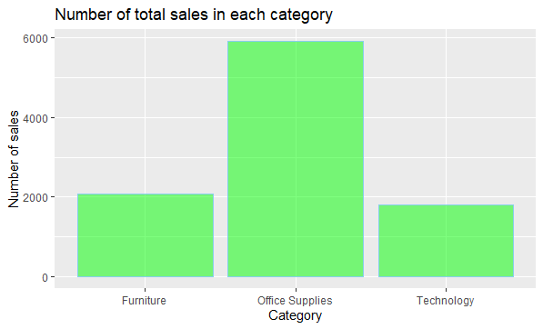
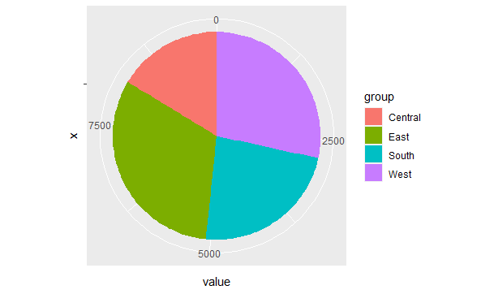

# Assignment 4 : Part A

Dataset from [superstore_sales.csv](https://raw.githubusercontent.com/safesit23/INT214-Statistics/main/datasets/superstore_sales.csv)

**Created by Pataradanai Deeruksa (ID: 63130500090)**

Choose Dataset : 2. Superstore Sales Dataset (Data from Rohit Sahoo,[Kaggle](https://www.kaggle.com/rohitsahoo/sales-forecasting)) >> [Using CSV](https://raw.githubusercontent.com/safesit23/INT214-Statistics/main/datasets/superstore_sales.csv)

## Overviews
1. Explore the Superstore Sales Dataset
2. Learning function from 'tidyverse'
3. Define a question and finding insight the data (Transform data with 'dplyr')
4. Visualization with 'GGplot2'

# Part 1 : Explore the Superstore Sales Dataset
## Part 1.1  Loading Library and dataset

### Install packages (First time) and use library
```
#install packages
install.packages("dplyr")
install.packages("readr")
install.packages("ggplot2")
install.packages("stringr")

#use library
library(dplyr)
library(readr)
library(ggplot2)
library(stringr)
```

### Import dataset 
```
#import dataset 
superstore <- read.csv("https://raw.githubusercontent.com/safesit23/INT214-Statistics/main/datasets/superstore_sales.csv")
```
## Part 1.2 Explore the dataset

### Explore the data set (View and glimpse)
```
#view
View(superstore) 
```
```
#glimpse
glimpse(superstore)
```
### Some results from View(superstore)


### In this dataset has 9,800 rows and 18 columns (the result of glimpse(superstore))
```
Rows: 9,800
Columns: 18
$ Row.ID        <int> 1, 2, 3, 4, 5, 6, 7, 8, 9, 10, 11, 12, 13, 14, 15, 16, 17, 18, 19, 20, 21, 22, 23, 24, 25, 26, 27, 2~
$ Order.ID      <chr> "CA-2017-152156", "CA-2017-152156", "CA-2017-138688", "US-2016-108966", "US-2016-108966", "CA-2015-1~
$ Order.Date    <chr> "08/11/2017", "08/11/2017", "12/06/2017", "11/10/2016", "11/10/2016", "09/06/2015", "09/06/2015", "0~
$ Ship.Date     <chr> "11/11/2017", "11/11/2017", "16/06/2017", "18/10/2016", "18/10/2016", "14/06/2015", "14/06/2015", "1~
$ Ship.Mode     <chr> "Second Class", "Second Class", "Second Class", "Standard Class", "Standard Class", "Standard Class"~
$ Customer.ID   <chr> "CG-12520", "CG-12520", "DV-13045", "SO-20335", "SO-20335", "BH-11710", "BH-11710", "BH-11710", "BH-~
$ Customer.Name <chr> "Claire Gute", "Claire Gute", "Darrin Van Huff", "Sean O'Donnell", "Sean O'Donnell", "Brosina Hoffma~
$ Segment       <chr> "Consumer", "Consumer", "Corporate", "Consumer", "Consumer", "Consumer", "Consumer", "Consumer", "Co~
$ Country       <chr> "United States", "United States", "United States", "United States", "United States", "United States"~
$ City          <chr> "Henderson", "Henderson", "Los Angeles", "Fort Lauderdale", "Fort Lauderdale", "Los Angeles", "Los A~
$ State         <chr> "Kentucky", "Kentucky", "California", "Florida", "Florida", "California", "California", "California"~
$ Postal.Code   <int> 42420, 42420, 90036, 33311, 33311, 90032, 90032, 90032, 90032, 90032, 90032, 90032, 28027, 98103, 76~
$ Region        <chr> "South", "South", "West", "South", "South", "West", "West", "West", "West", "West", "West", "West", ~
$ Product.ID    <chr> "FUR-BO-10001798", "FUR-CH-10000454", "OFF-LA-10000240", "FUR-TA-10000577", "OFF-ST-10000760", "FUR-~
$ Category      <chr> "Furniture", "Furniture", "Office Supplies", "Furniture", "Office Supplies", "Furniture", "Office Su~
$ Sub.Category  <chr> "Bookcases", "Chairs", "Labels", "Tables", "Storage", "Furnishings", "Art", "Phones", "Binders", "Ap~
$ Product.Name  <chr> "Bush Somerset Collection Bookcase", "Hon Deluxe Fabric Upholstered Stacking Chairs, Rounded Back", ~
$ Sales         <dbl> 261.9600, 731.9400, 14.6200, 957.5775, 22.3680, 48.8600, 7.2800, 907.1520, 18.5040, 114.9000, 1706.1~
```

# Part 2 : Learning function from 'tidyverse'

- Functions ```ymd()``` is a functions to work with date-month-year from package ```lubridate``` you can use ```dmy() ```and ```myd()```
y is the year , m is the month and d is the day
```
ymd(20011128)
#[1] "2001-11-28"
```

- Functions ```word()``` is a functions to work with string from package ```stringr``` you can use ```word(string,start 1..length)```and ```word(string,start -1..-length)```
and you can use ``` : ``` to be able to find the value of the next String

```
mystring <- ("63130500090 Pataradanai Deeruksa Tle")
word(mystring,3)
#[1] "Deeruksa"
word(mystring,-1:-2)
#[1] "Tle"      "Deeruksa"
```
# Part 3: Transform data with dplyr and finding insight the data

## Define a question and transform data

### 1. Find the customer name that bought the state Kentucky.
```
#1.Find the customer name that bought the state Kentucky.
Kentucky <- superstore %>% filter(superstore$State == "Kentucky" )
Kentucky %>% distinct(Kentucky$Customer.Name)
```
### Result:
#### Some of the 56 answers
```
Kentucky$Customer.Name
1             Claire Gute
2        Victoria Brennan
3          Darren Koutras
4        Bruce Degenhardt
5             Roy Collins
6              Joel Eaton
7              Art Foster
8                Rob Dowd
9               Liz Preis
10      Natalie DeCherney
11         Pauline Webber
12          Bobby Odegard
13        Katharine Harms
14         Joni Wasserman
15         Karen Carlisle
...(56)
```
### Explain :
- ใช้ ```filter()``` เพื่อหา state ที่ชื่อ Kentucky เท่านั้น
- ใช้ ```distinct()``` เพื่อเอาข้อมูลที่ซ้ำออกแล้วโชว์ออกมา

### 2. Find the customer name,order date,ship date and sale at sales less than 10.
```
#2.Find the customer name,order date,ship date and sale at sales less than 10
#And the sum of customers with less than 10 sales.
sum(superstore$Sales < 10)
superstore %>% select(Customer.Name, Order.Date , Ship.Date , Sales) %>% filter(superstore$Sales < 10)

```
### Result:
#### Some of the 250 answers
```
> superstore %>% select(Customer.Name, Order.Date , Ship.Date , Sales) %>% filter(superstore$Sales < 10)
           Customer.Name Order.Date  Ship.Date Sales
1        Brosina Hoffman 09/06/2015 14/06/2015 7.280
2          Harold Pawlan 22/11/2016 26/11/2016 2.544
3     Zuschuss Donatelli 27/08/2015 01/09/2015 8.560
4        Tracy Blumstein 17/09/2016 21/09/2016 9.618
5        Tracy Blumstein 17/09/2016 21/09/2016 3.264
6        Tracy Blumstein 17/09/2016 21/09/2016 6.858
7          Darren Powers 18/04/2016 22/04/2016 6.160
8        Ted Butterfield 17/06/2017 18/06/2017 1.680
9      Henry MacAllister 18/09/2017 23/09/2017 4.616
10           Ken Brennan 09/12/2018 11/12/2018 1.248
...(250)

> sum(superstore$Sales < 10)
[1] 1337
```
### Explain :
- ใช้ ```select()``` เพื่อเลือกเฉพาะคอลัมน์ที่ต้องการมาแสดงและใช้ ```filter()``` เพื่อกรองข้อมูลเฉพาะที่ Sales น้อยกว่า 10
- ใช้ ```sum()``` เพื่อหาค่าผลรวมของข้อมูลคอลัมน์ Sales ที่น้อยกว่า 10

### 3. Find the maximum and minimum values of sales and show product name.
```
#3.Find the maximum and minimum values of sales and show product name
maxsale <- max(superstore$Sales)
minsale <- min(superstore$Sales)
superstore %>% select(Product.Name,Sales) %>% filter(superstore$Sales == maxsale)
superstore %>% select(Product.Name,Sales) %>% filter(superstore$Sales == minsale)
```
### Result:
```
> superstore %>% select(Product.Name,Sales) %>% filter(superstore$Sales == maxsale)
                                           Product.Name    Sales
1 Cisco TelePresence System EX90 Videoconferencing Unit 22638.48

> superstore %>% select(Product.Name,Sales) %>% filter(superstore$Sales == minsale)
                                                                Product.Name Sales
1 Hoover Replacement Belt for Commercial Guardsman Heavy-Duty Upright Vacuum 0.444
```
### Explain :
- ใช้ ```max()``` เพื่อหาค่าที่มากที่สุดของคอลัมน์ Sales และหาค่าที่ต่ำที่สุดของคอลัมน์ Sales โดยใช้ ```min()``` และ assign ค่าเก็บไว้ที่ตัวแปร
- ใช้ ```select()``` เพื่อเลือกคอลัมน์ที่ต้องการจะแสดงและใช้ ```filter()``` เพื่อจะเลือกเฉพาะคอลัมน์ Sales ที่มากที่สุดและต่ำที่สุด 

### 4. Find the total sales in 2018.
```
#4.Find the total sales in 2018.
superstore %>% mutate(year = year(dmy(superstore$Order.Date))) %>% filter(year==2018) %>% count() %>% rename(totalsales = n)
```
### Result:
```
> superstore %>% mutate(year = year(dmy(superstore$Order.Date))) %>% filter(year==2018) %>% count() %>% rename(totalsales = n)
  totalsales
1       3258
```
### Explain :
- ใช้ ```mutate()```เพื่อสร้างคอลัมน์ใหม่โดยที่มีข้อมูลปีของคอลัมน์ Order.Date เพื่อที่จะแยกข้อมูลปีออกและใช้ ```filter()``` เพื่อเลือกเอาเฉพาะปี 2018 
- ใช้ ```count()```เพื่อนับข้อมูลของ order และใช้ ```rename()```เพื่อเปลี่ยนชื่อคอลัมน์

### 5. Find the total sales of each city. How much  can you sell?
```
#5.Find the total sales of each city. How much  can you sell?
superstore %>% group_by(City) %>% summarise(sum(Sales)) %>% rename(Total_Amount = `sum(Sales)`)
```
### Result:
#### Some of the 519 rows
```
# A tibble: 529 x 2
   City        Total_Amount
   <chr>              <dbl>
 1 Aberdeen           25.5 
 2 Abilene             1.39
 3 Akron            2724.  
 4 Albuquerque      2220.  
 5 Alexandria       5520.  
 6 Allen             290.  
 7 Allentown         853.  
 8 Altoona            20.5 
 9 Amarillo         3773.  
10 Anaheim          5601.  
# ... with 519 more rows
```
### Explain :
- ใช้ ```group_by()``` เพื่อจัดกลุ่มของข้อมูลเนื่องจากมีการใช้ ```sum()``` เพื่อรวมค่าของจำนวนที่ขายได้ทั้งหมด 
- ใช้ ```rename()``` เพื่อเปลี่ยนชื่อคอลัมน์ให้สื่อความหมายมากขึ้น

### 6. Unique search for the first 10 customer names.
```
#6.Unique search for the first 10 customer names.
superstore %>% distinct(Customer.Name) %>% head(10)
```
### Result:
```
Customer.Name
1         Claire Gute
2     Darrin Van Huff
3      Sean O'Donnell
4     Brosina Hoffman
5        Andrew Allen
6        Irene Maddox
7       Harold Pawlan
8           Pete Kriz
9     Alejandro Grove
10 Zuschuss Donatelli
```
### Explain :
- ใช้ ```distinct()``` เพื่อเลือกข้อมูลที่ไม่ซ้ำกัน
- ใช้ ```head()``` เพื่อแสดงข้อมูลบางส่วนที่เป็นเฉพาะส่วนหัว

# Part 4: Visualization with GGplot2
### This graph shows the number of categories with the most sales, respectively.
```
bar_plot <- ggplot(superstore,aes(x=Category)) + geom_bar(color="skyblue",fill="green",alpha=0.5)
bar_plot

# Adding component
bar_plot + ggtitle("Number of total sales in each category") +
xlab("Category") + ylab("Number of sales")
```
Result:



- เป็นกราฟที่บอกสัดส่วนของ Category ที่มียอด Sales แต่ที่มากที่สุดของแต่ละรายการ
### This graph shows region proportion.
```
group = c(superstore %>% distinct(Region))
value = c(superstore %>% count(Region) %>% select(n))
group <- as.character(unlist(group)) 
value <- as.numeric(unlist(value)) 
data <- data.frame(group,value)

# Create bar plot
bp <- ggplot(data, aes(x="", y=value, fill=group))+ geom_bar(width = 1, stat = "identity")
# put bar plot to pie
pie <- bp + coord_polar("y", start=0)
pie
```
Result:



- เป็นกราฟที่บอกสัดส่วนของภูมิภาคของแต่ละภาคว่าแต่ละภาคมีการสั่งสินค้ามากที่สุด

# Assignment 4 : Part B
[Data Visualization](https://app.powerbi.com/links/9YDnlNvTir?ctid=6f4432dc-20d2-441d-b1db-ac3380ba633d&pbi_source=linkShare)
