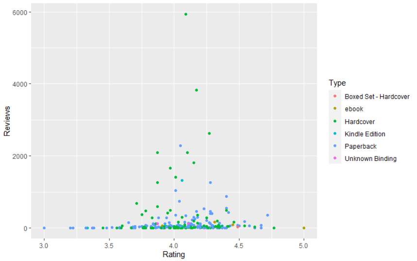
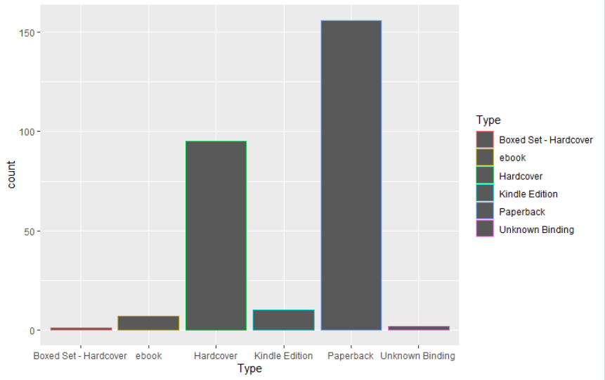

# R-Assignment 4

**Created by Montira Kongsanthia (ID : 63130500095)**

Choose Dataset:
Top 270 Computer Science / Programing Books (Data from Thomas Konstantin, [Kaggle](https://www.kaggle.com/thomaskonstantin/top-270-rated-computer-science-programing-books)) >> [Using CSV](https://raw.githubusercontent.com/safesit23/INT214-Statistics/main/datasets/prog_book.csv)


# Part A
### Outlines

1. Explore the dataset
2. Learning function from Tidyverse
3. Transform data with dplyr and finding insight the data
4. Visualization with GGplot2

## Part 1: Explore the dataset

```
# Load Library
library(readr)
library(dplyr)
library(ggplot2)
library(DescTools)

# Load Dataset
dataset <- read_csv("https://raw.githubusercontent.com/safesit23/INT214-Statistics/main/datasets/prog_book.csv")

# Explore the dataset
glimpse(Progbook)
View(Progbook) 
```

In this dataset has 
```
Rows: 271
Columns: 7
$ Rating          <dbl> 4.17, 4.01, 3.33, 3.97, 4.06, 3.84, 4.09, 4.15, 3...
$ Reviews         <dbl> 3829, 1406, 0, 1658, 1325, 117, 5938, 1817, 2093, ...
$ Book_title      <chr> "The Elements of Style", "The Information: A Histo...
$ Description     <chr> "This style manual offers practical advice on impr...
$ Number_Of_Pages <dbl> 105, 527, 50, 393, 305, 288, 256, 368, 259, 128, 3...
$ Type            <chr> "Hardcover", "Hardcover", "Kindle Edition", "Hardc...
$ Price           <dbl> 9.323529, 11.000000, 11.267647, 12.873529, 13.1647...
```

## Part 2 : Learning function from Tidyverse

- Function `slice_min()` and `slice_max()` from package ([dplyr](https://cran.r-project.org/web/packages/dplyr/vignettes/dplyr.html)). to select rows with highest or lowest values of a variable.

```
          Progbook %>% slice_max(Number_Of_Pages)
```

## Part 3 : Transform data with dplyr and finding insight the data

1. หนังสือที่มีราคาน้อยที่สุด มีการรีวิวอยู่ที่เท่าไหร่

```
        Progbook %>% select(Book_title, Price, Reviews) %>% slice_min(Price)

# result

  Book_title            Price Reviews
  <chr>                 <dbl>   <dbl>
1 The Elements of Style  9.32    3829

# explain

  • ใช้ select() เพื่อเลือก Book_title , Price และ Reviews
  • ใช้ slice_min() เพื่อหา ค่าที่น้อยที่สุดของ Price
```  
  
  
2. หนังสือเล่มใดมีจำนวนหน้ามากที่สุด 5 อันดับ

```
        Progbook %>% select(Book_title, Number_Of_Pages) %>% slice_max(Number_Of_Pages, n=5)

# result

  Book_title                                                                    Number_Of_Pages
  <chr>                                                                                   <dbl>
1 The Art of Computer Programming, Volumes 1-4a Boxed Set                                  3168
2 The Linux Programming Interface: A Linux and Unix System Programming Handbook            1506
3 Numerical Recipes: The Art of Scientific Computing                                       1235
4 Learning Python                                                                          1214
5 Beginning Java 2                                                                         1200

# explain

  • ใช้ select() เพื่อเลือก Book_title และ Number_Of_Pages
  • ใช้ slice_max() เพื่อหา ค่าที่มากที่สุดของ Number_Of_Pages จากนั้นใช้ n=5 เพื่อเลือก 5 ค่าแรก
  ```  
  
  
3. หนังสือที่มีการรีวิวมากกว่า 1000 เล่มใดมีราคามากที่สุด

```
        Progbook %>% select(Book_title, Reviews, Price) %>% filter(Reviews > 1000) %>% slice_max(Price)

# result

  Book_title                                 Reviews Price
  <chr>                                        <dbl> <dbl>
1 The Goal: A Process of Ongoing Improvement    2290  37.1

# explain

  • ใช้ select() เพื่อเลือก Book_title , Reviews และ Price
  • ใช้ filter() เพื่อเลือกค่าของ Reviews ที่มากกว่า 1000
  • ใช้ slice_max() เพื่อหา ค่าที่มากที่สุดของ Price
  ```  
  
  
4. ค่าเฉลี่ยราคาของหนังสือประเภท ebook อยู่ที่เท่าไหร่

```
        Progbook %>% filter(Type == 'ebook') %>% summarise(avg = mean(Price, na.rm = TRUE)) 

# result

    avg
  <dbl>
1  51.4

# explain

  • ใช้ filter() เพื่อเลือกค่าของ Type ที่ชื่อว่า ebook
  • ใช้ summarise() ในการหาค่าเฉลี่ยของ Price
   ```  
  
  
5. หนังสือที่มีราคามากที่สุดโดยมี Rating มากกว่า 4

```
        Progbook %>% select(Book_title, Price, Rating) %>% filter(Rating > 4) %>% slice_max(Price)

# result

  Book_title                                              Price Rating
  <chr>                                                   <dbl>  <dbl>
1 The Art of Computer Programming, Volumes 1-3 Boxed Set   220.   4.49
2 The Art of Computer Programming, Volumes 1-4a Boxed Set  220.   4.77

# explain

  • ใช้ select() เพื่อเลือก Book_title , Price และ Rating
  • ใช้ filter() เพื่อเลือกค่าของ Rating ที่มากกว่า 4
  • ใช้ slice_max() เพื่อหา ค่าที่มากที่สุดของ Price
  ```  
  
  
6. หนังสือแต่ละประเภทมีอะไรบ้าง

```
        Progbook %>% count(Type)

# result

    Type                      n
  <chr>                 <int>
1 Boxed Set - Hardcover     1
2 ebook                     7
3 Hardcover                95
4 Kindle Edition           10
5 Paperback               156
6 Unknown Binding           2

# explain

  • ใช้ count() เพื่อนับจำนวนของ Type แต่ละประเภท
```

## Part 4: Visualization with GGplot2
###   1) กราฟความสัมพันธ์ระหว่าง Reviews และ Rating

      scat_plot <- Progbook %>% ggplot(aes(x=Rating,y=Reviews))+geom_point(aes(color=Type))
      scat_plot
      
      
      # result


      # explain
           • เป็นกราฟที่ใช้แสดงความสัมพันธ์ของ Reviews และ Rating ของแต่ละประเภทหนังสือ โดยแนวตั้งจะแสดงข้อมูลของ Reviews 
             และแนวตั้งจะแสดงข้อมูลของ Rating จากนั้นแสดงสีของจุดเพื่อแยกประเภทของหนังสือ

 
###   2) แผนภูมิแท่งแสดงประเภทของหนังสือต่างๆ

      scat_plot1 <- Progbook %>% ggplot(aes(x=Type)) + geom_bar(aes(color=Type))
      scat_plot1
      
      
      # result


      # explain
           • เป็นกราฟแผนภูมิแท่งเพื่อแสดงจำนวนของหนังสือในแต่ละประเภท โดยแนวตั้งเป็นจำนวนหนังสือที่นับได้และแนวนอนแสดงประเภทของหนังสือ

 
