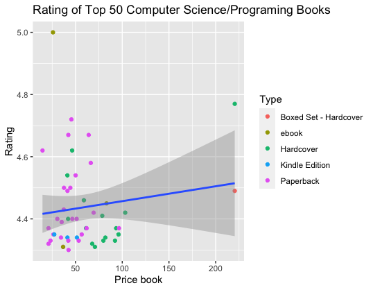
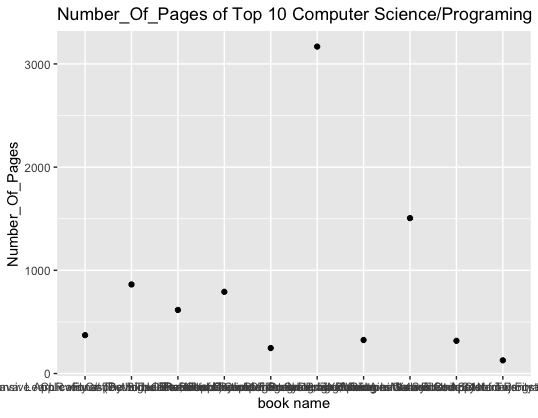

# R-Assignment 4

**Created by Radakorn Thongwilai (ID: 63130500098)**

Choose Dataset:
1. Top 270 Computer Science / Programing Books (Data from Thomas Konstantin, [Kaggle](https://www.kaggle.com/thomaskonstantin/top-270-rated-computer-science-programing-books)) >> [Using CSV](https://raw.githubusercontent.com/safesit23/INT214-Statistics/main/datasets/prog_book.csv)


### Outlines
1. Explore the dataset
2. Learning function from Tidyverse
3. Transform data with dplyr and finding insight the data
4. Visualization with GGplot2

## Part 1: Explore the dataset

```
#install package
install.packages("ggplot2")

# Library
library(dplyr)
library(tidyr)
library(readr)
library(ggplot2)

# Dataset
topcombook <- read.csv("https://raw.githubusercontent.com/safesit23/INT214-Statistics/main/datasets/prog_book.csv")

# Explore the dataset
glimpse(topcombook)
View(topcombook)
```

In this dataset has 271 rows and 7 columns about top 270 Computer Science / Programing Books
```
Rows: 271
Columns: 7
$ Rating          <dbl> 4.17, 4.01, 3.33, 3.97, 4.06, 3.84, 4.09, 4.15, 3.87, 4.…
$ Reviews         <chr> "3,829", "1,406", "0", "1,658", "1,325", "117", "5,938",…
$ Book_title      <chr> "The Elements of Style", "The Information: A History, a …
$ Description     <chr> "This style manual offers practical advice on improving …
$ Number_Of_Pages <int> 105, 527, 50, 393, 305, 288, 256, 368, 259, 128, 352, 35…
$ Type            <chr> "Hardcover", "Hardcover", "Kindle Edition", "Hardcover",…
$ Price           <dbl> 9.323529, 11.000000, 11.267647, 12.873529, 13.164706, 14…

```


## Part 2: Learning function from Tidyverse

- Function arrange(desc()) from package ([dplyr](https://dplyr.tidyverse.org/articles/dplyr.html#select-columns-with-select)). to sort order a column in descending order.

```
          topcombook %>% arrange(desc(Rating))
```


## Part 3: Transform data with dplyr and finding insight the data

1.Top 3 of Computer Science / Programing Books sort by Rating.

```
topcombook %>% select(Rating,Book_title) %>% arrange(desc(Rating)) %>% head(3)
```
Explain
-ใช้ select()เพื่อเลือก Rating และ Book_title 
-ใช้ arrange(desc()) เพื่อเรียงลำดับหนังสือจาก Rating มากไปน้อย 
-แล้วใช้ head(3) เพื่อแสดงชื่อหลังสือและrating 3 อันดับแรก

Result:

```
Rating
1   5.00
2   4.77
3   4.72
 Book_title
1                                                                                  Your First App: Node.js
2                                                  The Art of Computer Programming, Volumes 1-4a Boxed Set
3 Designing Data-Intensive Applications: The Big Ideas Behind Reliable, Scalable, and Maintainable Systems
```

2.The book has a price under 10$ is The Elements of Style

```
topcombook %>% select(Price,Book_title ) %>% filter(Price < 10.0)
```
Explain
-ใช้ select()เพื่อเลือก Price และ Book_title 
-ใช้ filter()เพื่อหาหนังสือที่มีราคาน้อยกว่า 10

Result :
```
  Price            Book_title
1 9.323529 The Elements of Style
```

3. 7 ebook from top 270 Computer Science / Programing Books

```
topcombook %>% select(Type) %>% count(Type) %>% filter(Type == "ebook")
```
Explain
-ใช้ select()เพื่อเลือก Type ของหนังสือ
-ใช้ count(Type) เพื่อแยกจำนวนของหนังสือแต่ละประเภท
-ใช้ filter(Type == "ebook") เพื่อแสดงเฉพาะหนังสือประเภท ebook และจำนวน

Result :
```
Type  n
ebook 7
```

4.หนังสือเรื่อง The Art of Computer Programming, Volumes 1-4a Boxed Set มีจำนวนหน้ามากที่สุดถึง 3168 หน้า

```
topcombook %>% select(Book_title,Number_Of_Pages) %>% arrange(desc(Number_Of_Pages)) %>% head(1)
```
Explain
-ใช้ select()เพื่อเลือก Book_title และ Number_Of_Pages ของหนังสือ
-ใช้ arrange(desc()) เพื่อเรียงลำดับหนังสือจากจำนวนหน้ามากไปน้อย 
-ใช้ head(1) เพื่อแสดงเฉพาะหนังสือลำดับบนสุดซึ่งมีจำนวนหน้ามากสุด

Result :
```
Book_title                                              Number_Of_Pages
The Art of Computer Programming, Volumes 1-4a Boxed Set            3168
```

5.หนังสือประเภท hardcover ที่มี Rating สูงที่สุดคือ The Art of Computer Programming, Volumes 1-4a Boxed Set ซึ่งมีจำนวนหน้ามากที่สุดเช่นกัน

```
topcombook %>% select(Book_title,Rating,Type) %>% filter(Type == "Hardcover") %>% arrange(desc(Rating)) %>% head(1)
```
Explain
-ใช้ select()เพื่อเลือก Book_title,Rating และ Type ของหนังสือ
-ใช้ filter(Type == "Hardcover") เพื่อแสดงเฉพาะหนังสือประเภท Hardcover 
-ใช้ arrange(desc()) เพื่อเรียงลำดับหนังสือจาก Rating มากไปน้อย 
-ใช้ head(1) เพื่อแสดงเฉพาะหนังสือประเภท Hardcover ลำดับบนสุดซึ่งมี Rating สูงสุด

Result :
```
Book_title                                                Rating      Type
1 The Art of Computer Programming, Volumes 1-4a Boxed Set   4.77 Hardcover
```

6.ชื่อหนังสือที่มี Rating ต่ำที่สุดคือ Lambda-Calculus, Combinators and Functional Programming ซึ่งได้รับเรตติ้งเพียง 3 เท่านั้น

```
topcombook %>% select(Rating,Book_title) %>% arrange(desc(Rating)) %>% tail(1)
```
Explain
-ใช้ select()เพื่อเลือก Book_title และ Rating  ของหนังสือ
-ใช้ arrange(desc()) เพื่อเรียงลำดับหนังสือจาก Rating มากไปน้อย 
-ใช้ tail(1) เพื่อแสดงเฉพาะหนังสือลำดับล่างสุด(1จากท้าย)ซึ่งมี Rating ต่ำสุด

Result :
```
Rating                                              Book_title
   3     Lambda-Calculus, Combinators and Functional Programming
```
7.Ratingเฉลี่ยและจำนวนหน้าของหนังสือแต่ละประเภทโดยเฉลี่ย

```
topcombook %>% group_by(Type) %>% summarise(Number_Of_Pages = mean(Number_Of_Pages,na.rm = T),Rating = mean(Rating,na.rm=T))
```
Explain
-ใช้ group_by(Type) เพื่อจัดเป็นหนังสือแต่ละประเภท
-ใช้ summarise() ในสรุปการหาค่าเฉลี่ยของจำนวนหน้า Number_Of_Pages = mean(Number_Of_Pages,na.rm = T และเรตติ้งของหนังสือแต่ละประเภท Rating = mean(Rating,na.rm=T

Result :
```
 Type                  Number_Of_Pages Rating
  <chr>                           <dbl>  <dbl>
1 Boxed Set - Hardcover            896    4.49
2 ebook                            386    4.29
3 Hardcover                        614.   4.06
4 Kindle Edition                   283.   4.01
5 Paperback                        407.   4.06
6 Unknown Binding                  249    3.99
```

## Part 4: Visualization with GGplot2
### 1.) Graph show relation between height and mass
```
#Scatter Plot
topbook_plot <- topcombook %>% select(Rating,Type,Price) %>% arrange(desc(Rating)) %>% head(50) %>% ggplot(aes(x=Price,y=Rating))+
  geom_point(aes(color=Type))

# Adding component
topbook_plot + ggtitle("Rating of Top 50 Computer Science/Programing Books") +
  xlab("Price book") + ylab("Rating") +geom_smooth(method="lm")

```
Result:



Explain
-กราฟแสดงเรตติ้งและราคาของหนังสือที่อยู่ใน TOP 50 ของratingมากไปน้อย โดยแสดงสีของจุดเพื่อแยกประเภทของหนังสือ

```
topbook_plot2 <- topcombook %>% select(Number_Of_Pages,Book_title,Rating )%>% arrange(desc(Rating)) %>% head(10) %>% ggplot(aes(x=Book_title ,y=Number_Of_Pages))+
  geom_point()
  
topbook_plot2 + ggtitle("Number_Of_Pages of Top 10 Computer Science/Programing Books") + xlab("book name") + ylab("Number_Of_Pages")

```
Result:



Explain
-กราฟแสดงจำนวนหน้าของหนังสือที่มีเรตติ้งสูงสุด 10 อันดับแรก

