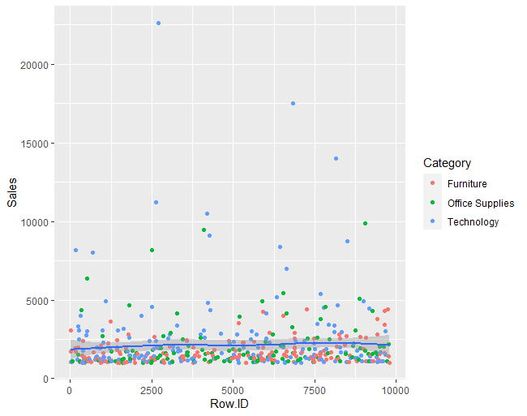
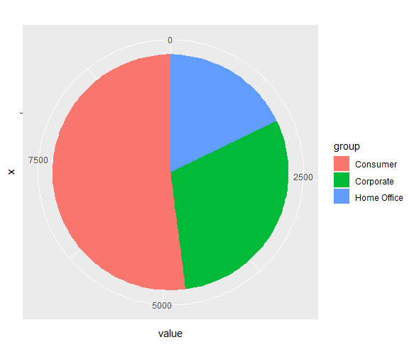

# Assignment 4 : Part A

Dataset from [superstore_sales.csv](https://raw.githubusercontent.com/safesit23/INT214-Statistics/main/datasets/superstore_sales.csv)

**Created by Suwaphit Chotsawad (ID: 63130500126)**

Choose Dataset : 2. Superstore Sales Dataset (Data from Rohit Sahoo,[Kaggle](https://www.kaggle.com/rohitsahoo/sales-forecasting)) >> [Using CSV](https://raw.githubusercontent.com/safesit23/INT214-Statistics/main/datasets/superstore_sales.csv)

## Overviews
1. Explore the Superstore Sales Dataset
2. Learning function from 'tidyverse'
3. Define a question and finding insight the data (Transform data with 'dplyr')
4. Visualization with 'ggplot2'

# Part 1 : Explore the Superstore Sales Dataset
### My Step
1. Loading Library and dataset
2. Explore the dataset

## Loading library and dataset

```
# Install package(for first time)
install.packages("dplyr")
install.packages("readr")
install.packages("ggplot2")
install.packages("stringr")

# Library
library(dplyr)
library(readr)
library(ggplot2)
library(stringr)

# Dataset
superstore <- read.csv("https://raw.githubusercontent.com/safesit23/INT214-Statistics/main/datasets/superstore_sales.csv")
```
## Explore the dataset
```
# Explore the data set
View(superstore) 
# or
glimpse(superstore)
```
In this dataset has 9,800 rows and 18 columns to store data about retail dataset of a global superstore for 4 years that contain
```
$ `Row ID`        <dbl> 1, 2, 3, 4, 5, 6, 7, 8, 9, 10, 11, 12, 13, 14, 15, 16, 17, 18, 19, 20, 21, 22, 23, 24, 25, 26, 27, 28, 2~
$ `Order ID`      <chr> "CA-2017-152156", "CA-2017-152156", "CA-2017-138688", "US-2016-108966", "US-2016-108966", "CA-2015-11581~
$ `Order Date`    <chr> "08/11/2017", "08/11/2017", "12/06/2017", "11/10/2016", "11/10/2016", "09/06/2015", "09/06/2015", "09/06~
$ `Ship Date`     <chr> "11/11/2017", "11/11/2017", "16/06/2017", "18/10/2016", "18/10/2016", "14/06/2015", "14/06/2015", "14/06~
$ `Ship Mode`     <chr> "Second Class", "Second Class", "Second Class", "Standard Class", "Standard Class", "Standard Class", "S~
$ `Customer ID`   <chr> "CG-12520", "CG-12520", "DV-13045", "SO-20335", "SO-20335", "BH-11710", "BH-11710", "BH-11710", "BH-1171~
$ `Customer Name` <chr> "Claire Gute", "Claire Gute", "Darrin Van Huff", "Sean O'Donnell", "Sean O'Donnell", "Brosina Hoffman", ~
$ Segment         <chr> "Consumer", "Consumer", "Corporate", "Consumer", "Consumer", "Consumer", "Consumer", "Consumer", "Consum~
$ Country         <chr> "United States", "United States", "United States", "United States", "United States", "United States", "U~
$ City            <chr> "Henderson", "Henderson", "Los Angeles", "Fort Lauderdale", "Fort Lauderdale", "Los Angeles", "Los Angel~
$ State           <chr> "Kentucky", "Kentucky", "California", "Florida", "Florida", "California", "California", "California", "C~
$ `Postal Code`   <dbl> 42420, 42420, 90036, 33311, 33311, 90032, 90032, 90032, 90032, 90032, 90032, 90032, 28027, 98103, 76106,~
$ Region          <chr> "South", "South", "West", "South", "South", "West", "West", "West", "West", "West", "West", "West", "Sou~
$ `Product ID`    <chr> "FUR-BO-10001798", "FUR-CH-10000454", "OFF-LA-10000240", "FUR-TA-10000577", "OFF-ST-10000760", "FUR-FU-1~
$ Category        <chr> "Furniture", "Furniture", "Office Supplies", "Furniture", "Office Supplies", "Furniture", "Office Suppli~
$ `Sub-Category`  <chr> "Bookcases", "Chairs", "Labels", "Tables", "Storage", "Furnishings", "Art", "Phones", "Binders", "Applia~
$ `Product Name`  <chr> "Bush Somerset Collection Bookcase", "Hon Deluxe Fabric Upholstered Stacking Chairs, Rounded Back", "Sel~
$ Sales           <dbl> 261.9600, 731.9400, 14.6200, 957.5775, 22.3680, 48.8600, 7.2800, 907.1520, 18.5040, 114.9000, 1706.1840,~
```

# Part 2 : Learning function from 'tidyverse'
- Package ```lubridate``` is a Date-time data can be frustrating to work with in R. R commands. For example,feature ```ymd()```or```mdy()```
```
ymd(20101215)
# [1] "2010-12-15"
mdy("4/1/17")
# [1] "2017-04-01"
```
- Package ```stringr``` is built for correct implementations of common string manipulations. For example,feature```str_length()```and```str_count(x, pattern)``` for counts the number of patterns.
```
x <- c("why", "video", "cross", "extra", "deal", "authority")
str_length(x) 
# [1] 3 5 5 5 4 9
str_count(x, "[aeiou]")
# [1] 0 3 1 2 2 4
```
# Part 3 : Define a question and finding insight the data
### My steps
1. Define a question
2. Transform data with dplyr and finding insight the data

## Define a question and transform data

### 1. Find the customer name that bought the category furniture.
Solution :
```
Furniture <- superstore  %>% filter(superstore$Category == "Furniture" )
Furniture %>% distinct(Furniture$Customer.Name)
```
Explain :
- ใช้ filter เพื่อหารายการสินค้าทั้งหมดที่ category คือ  Furniture
- นำข้อมูลที่ได้มาเป็นเก็บไว้ที่ variable Furniture แล้วทำการดึงเฉพาะชื่อของลูกค้าออกมา show โดยไม่ซ้ำกัน

Reult :
```
    Furniture$Customer.Name
1               Claire Gute
2            Sean O'Donnell
3           Brosina Hoffman
4           Sandra Flanagan
5               Emily Burns
6           Tracy Blumstein
7                 Gene Hale
8              Steve Nguyen
9             Darren Powers
10          Ted Butterfield
...(705)
```
Answer : 
- This is the all name of customer that bought the category furniture and total customer that bought the category furniture is 705.


### 2. How many city of customer are there. And where is the most place that customer has buy the stuff ?
Solution :
```
city <- superstore %>% select(City) %>% count(City) %>% rename(cus_number = n)
max_cus <- max(city$number, na.rm = TRUE)
city %>% filter(city$number == max_cus )
```
Explain :
- ดึงข้อมูล City จาก superstore เพื่อนับจำนวน city จากนั้น rename column n เป็น number
- หาจำนวนสูงสุด โดยใช้ ```max()``` แล้วไปเก็บใน max_cus เพื่อให้สื่อความหมายถึงจำนวนลูกค้าได้ชัดเจนขึ้น
- หา city ที่มียอดสั่งซื้อมากที่สุดด้วย ```filter()```

Reult :
```
                 City       number
1            Aberdeen          1
2             Abilene          1
3               Akron         20
4         Albuquerque         14
5          Alexandria         16
6               Allen          4
7           Allentown          7
8             Altoona          2
9            Amarillo         10
10            Anaheim         19
...(500)
#-----------------
     City            number
1 New York City        891
```
Answer : 
- They has 500 city that customer has lived but New York City has a most sold that 891 solds. 


### 3. Find the total customer that just a normal person who had bought the stuff.
Solution :
```
superstore %>% count(Segment) %>% filter(Segment == "Consumer") %>% rename(total_cus = n)
```
Explain :
- นับว่า segment แต่ละประเภทมีจำนวนเท่าไหร่ จากนั้นค่อยดึงข้อมูลมาแค่ segment consumer เพื่อหาแค่ผู้บริโภค
- จากนั้นเปลี่ยนชื่อ column จาก n เป็น total_cus เพื่อให้สื่อความหมายถึงจำนวนลูกค้าได้ชัดเจนขึ้น
Reult :
```
 Segment     total_cus
1 Consumer      5101
```
Answer : 
- The number of customer that just consumer are 5101 people


### 4. How many total sales in 2015 ?
Solution :
```
superstore %>% mutate(year = year(dmy(superstore$Order.Date))) %>% filter(year==2015) %>% count() %>% rename(total_sale = n)
```
Explain :
- ทำการแยกเอาเฉพาะปีออกมาจาก Order Date จากนั้น filter หาเฉพาะปี 2015
- นับจำนวน order ทั้งหมดและเปลี่ยนชื่อ column เป็น total_sale เพื่อให้สื่อความหมายถึงจำนวนลูกค้าได้ชัดเจนขึ้น

Reult :
```
   total_sale
1       1953
```
Answer : 
Amount of order in 2015 is 1953 orders.

### 5. From question 4. how much the Super store got a money in 2015 ?
Solution :
```
order2015 <- superstore %>% mutate(year = year(dmy(superstore$Order.Date))) %>% filter(year==2015) 
sum(order2015$Sales)
```
Explain :
- ทำการแยกเอาเฉพาะปีออกมาจาก Order Date จากนั้น filter หาเฉพาะปี 2015
- นำค่าที่ได้ไปใส่ในตัวแปร order2015 แล้วหาผลรวมของรายได้ของแต่ละ order ในปี 2015

Reult :
```
[1] 479856.2
```
Answer : 
The money they've got from sale the product in 2015 is ```479856.2```.

### 6. Find the product name that have a most sold in this dataset.
Solution :
```
max_sale <- superstore %>% group_by(Product.Name) %>% summarise(total_sale = sum(Sales)) 
max_sale %>% select(Product.Name,total_sale) %>% filter(total_sale == max(max_sales$total_sale,na.rm=TRUE))
```
Explain :
- Group ชื่อของสินค้าและหาราคาทั้งหมดที่ขายได้ของสินค้าแต่ละชนิด
- เลือก column Product.Name,total_sale เพื่อนำมา filter หาค่า maxของ total_sale

Reult :
```
  Product.Name                          total_sale
  <chr>                                       <dbl>
1 Canon imageCLASS 2200 Advanced Copier      61600.

```
Answer : 
- Canon imageCLASS 2200 Advanced Copier is the most sold in this dataset that is ```61600```.

## Summary
//Content

# Part 4 : Visualization with 'ggplot2'
- This graph's show the relation of Sale price that more than 1000 in each Order devide by category
```
# Filter sales more than 1000 and Create scatter plot
scat_plot <- superstore %>% filter(Sales>1000) %>% ggplot(aes(x=Row.ID,y=Sales)) + geom_point(aes(color= Category))
scat_plot
scat_plot+geom_smooth()
```
Result :



- This graph's show proportional division of segment customer
```
# Create Data
group = c(superstore %>% distinct(Segment))
value = c(superstore %>% count(Segment) %>% select(n))
group <- as.character(unlist(group)) 
value <- as.numeric(unlist(value)) 
data <- data.frame(group,value)

# Create bar plot
bp <- ggplot(data, aes(x="", y=value, fill=group))+ geom_bar(width = 1, stat = "identity")
# put bar plot to pie
pie <- bp + coord_polar("y", start=0)
pie
```
Result :


