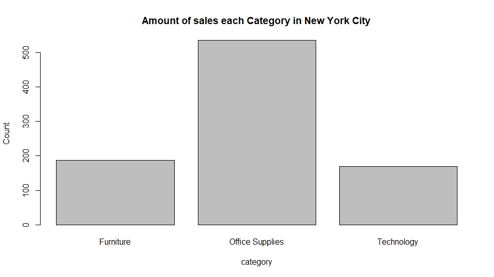
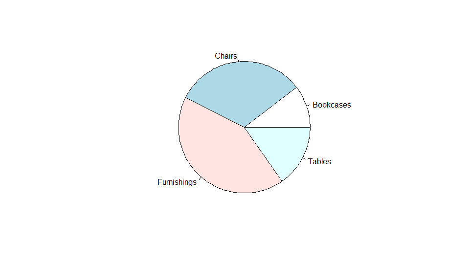

# Assignment 4 : Part A

**Created by Phuchit Uappapunsetty (ID: 63130500144)**

Choose Dataset : 2. Superstore Sales Dataset (Data from Rohit Sahoo,[Kaggle](https://www.kaggle.com/rohitsahoo/sales-forecasting)) >> [Using CSV](https://raw.githubusercontent.com/safesit23/INT214-Statistics/main/datasets/superstore_sales.csv)

## Overviews
1. Explore the Superstore Sales Dataset
2. Learning function from 'tidyverse'
3. Define a question and finding insight the data (Transform data with 'dplyr')
4. Visualization with 'ggplot2'

# Part 1 : Explore the Superstore Sales Dataset
### My Step
1. Loading Library and dataset
2. Explore the dataset

## Loading library and dataset

```
# Install package
install.packages("dplyr")
install.packages("assertive")
install.packages("readr")
install.packages("ggplot2")
install.packages("stringr")
install.packages("tidyr")

# Library
library(dplyr)
library(assertive)
library(readr)
library(ggplot2)
library(stringr)
library(tidyr)

# Dataset
superstore <- read.csv("https://raw.githubusercontent.com/safesit23/INT214-Statistics/main/datasets/superstore_sales.csv")
```
## Explore the dataset
```
# Explore the data set
View(superstore) 
# or
glimpse(superstore)
```
This dataset has 9,800 rows and 18 columns. This dataset show about the retail of a global superstore for 4 years.
```
$ Row.ID        <int> 1, 2, 3, 4, 5, 6, 7, 8, 9, 10, 11, 12, 13, 14, 15, 16, 17, 18, 19, 20, 21, 22, 23, 24, 25, 26, 27~
$ Order.ID      <chr> "CA-2017-152156", "CA-2017-152156", "CA-2017-138688", "US-2016-108966", "US-2016-108966", "CA-201~
$ Order.Date    <chr> "08/11/2017", "08/11/2017", "12/06/2017", "11/10/2016", "11/10/2016", "09/06/2015", "09/06/2015",~
$ Ship.Date     <chr> "11/11/2017", "11/11/2017", "16/06/2017", "18/10/2016", "18/10/2016", "14/06/2015", "14/06/2015",~
$ Ship.Mode     <chr> "Second Class", "Second Class", "Second Class", "Standard Class", "Standard Class", "Standard Cla~
$ Customer.ID   <chr> "CG-12520", "CG-12520", "DV-13045", "SO-20335", "SO-20335", "BH-11710", "BH-11710", "BH-11710", "~
$ Customer.Name <chr> "Claire Gute", "Claire Gute", "Darrin Van Huff", "Sean O'Donnell", "Sean O'Donnell", "Brosina Hof~
$ Segment       <chr> "Consumer", "Consumer", "Corporate", "Consumer", "Consumer", "Consumer", "Consumer", "Consumer", ~
$ Country       <chr> "United States", "United States", "United States", "United States", "United States", "United Stat~
$ City          <chr> "Henderson", "Henderson", "Los Angeles", "Fort Lauderdale", "Fort Lauderdale", "Los Angeles", "Lo~
$ State         <chr> "Kentucky", "Kentucky", "California", "Florida", "Florida", "California", "California", "Californ~
$ Postal.Code   <int> 42420, 42420, 90036, 33311, 33311, 90032, 90032, 90032, 90032, 90032, 90032, 90032, 28027, 98103,~
$ Region        <chr> "South", "South", "West", "South", "South", "West", "West", "West", "West", "West", "West", "West~
$ Product.ID    <chr> "FUR-BO-10001798", "FUR-CH-10000454", "OFF-LA-10000240", "FUR-TA-10000577", "OFF-ST-10000760", "F~
$ Category      <chr> "Furniture", "Furniture", "Office Supplies", "Furniture", "Office Supplies", "Furniture", "Office~
$ Sub.Category  <chr> "Bookcases", "Chairs", "Labels", "Tables", "Storage", "Furnishings", "Art", "Phones", "Binders", ~
$ Product.Name  <chr> "Bush Somerset Collection Bookcase", "Hon Deluxe Fabric Upholstered Stacking Chairs, Rounded Back~
$ Sales         <dbl> 261.9600, 731.9400, 14.6200, 957.5775, 22.3680, 48.8600, 7.2800, 907.1520, 18.5040, 114.9000, 170~
```

# Part 2 : Learning function from 'tidyverse'
- คำสั่ง relocate() ใน package dplyr มีหน้าที่สำหรับการ ย้ายตำแหน่งcolumn ไปยังที่ที่เราต้องการได้ โดยsyntaxคือ relocate(data(ชื่อตารางที่เราต้องการใช้คำสั่ง),...(columnที่เราต้องการย้าย), .before = ...(ย้ายไปตำแหน่งก่อนหน้าcolmun ที่ชื่ออะไร), .after = ...(ย้ายไปตำแหน่งที่อยู่หลังcolumn ที่ชื่ออะไร))
ยกตัวอย่างการใช้relocate -> ต้องการย้ายcolumn 'Country' ไปอยู่หลัง column 'City' เนื่องจากต้องการแสดงให้เห็นชื่อเมืองก่อน ที่จะเห็นประเทศ โดยคำสั่งที่จะใช้คือ
```
superstore <- relocate(superstore, Country, .after = City)

```

# Part 3 : Define a question and finding insight the data
### My steps
1. Define a question
2. Transform data with dplyr and finding insight the data

## Define a question and transform data

### 1. ให้แสดงค่าเฉลี่ยของ Sales ของสินค้าในจำพวก Furniture และ อยู่ที่เมือง Los Angeles
Solution : 
```
superstore %>% filter(Category == 'Furniture', City == 'Los Angeles') %>% dplyr::summarise(avg = mean(Sales, na.rm = TRUE))
```
Descriptive :
```
ใช้คำสั่ง filter(Category == 'Furniture', City == 'Los Angeles') เพื่อเป็นการกำหนดเงื่อนไขให้แสดงข้อมูลเฉพาะที่กำหนดในวงเล็บ 
และส่งข้อมูลที่ได้มาไปหาค่าเฉลี่ยโดยใช้คำสั่ง dplyr::summarise(avg = mean(Sales, na.rm = TRUE))
```
Result :
```
       avg
1 351.9463
```


### 2. ให้แสดงจำนวนการขายสินค้าจำพวก Furnitureทั้งหมด โดยแสดงในแต่ละภูมิภาค(group by ภูมิภาค)
Solution :
```
superstore %>% filter(Category == 'Furniture') %>% group_by(Region) %>% count(Category)
```
Descriptive :
```
คำสั่งแรกที่ใช้คือ filter(Category == 'Furniture') เพื่อให้ทำการกรองข้อมูลที่category = furniture ออกมา
คำสั่งต่อมาคือ group_by(Region) เพื่อทำการจัดหมวดหมู่ข้อมูลให้เป็นไปตามข้อมูลในวงเล็บ
จากนั้นจึงใช้คำสั่ง count(Category) เพื่อทำการนับจำนวนของcolumn Category ซึ่งข้อมูลในcategoryตอนนี้ จะมีแค่furniture จากการที่filterในคำสั่งแรก
```
Result :
```
Region  Category      n
  <chr>   <chr>     <int>
1 Central Furniture   470
2 East    Furniture   591
3 South   Furniture   326
4 West    Furniture   691
```


### 3. ให้แสดงชื่อลูกค้า และ Segment โดยประเภทการจัดส่งคือ First class และ สินค้าที่สั่งคือประเภท Phones ที่อยู่ในเมือง Springfield
Solution :
```
superstore %>% filter(Ship.Mode == 'First Class', Sub.Category == 'Phones', City == 'Springfield') %>% select(Customer.Name,Segment)
```
Descriptive :
```
ใช้คำสั่ง filter(Ship.Mode == 'First Class', Sub.Category == 'Phones', City == 'Springfield') เพื่อทำการกรองข้อมูลออกมาตามเงื่อนไขที่กำหนดในวงเล็บ
หลังจากนั้น ก็ใช้คำสั่ง select(Customer.Name,Segment) เพื่อเป็นการกำหนดข้อมูลที่จะแสดงตามที่ข้อมูลใส่ในวงเล็บ
```
Result :
```
Customer.Name     Segment
1 Corey Catlett   Corporate
2 Maria Etezadi  Home Office
```


### 4. ให้แสดงยอดขายรวมของสินค้าประเภท Art โดยให้แสดงตามเมือง และเรียงลำดับให้แสดงเมืองที่มียอดขายสูงสุดก่อน
Solution :
```
superstore %>% filter(Sub.Category == 'Art') %>% group_by(City) %>% dplyr::summarise(Sum = sum(Sales, na.rm = TRUE)) %>% arrange(desc(Sum))
```
Descriptive :
```
ใช้คำสั่ง filter(Sub.Category == 'Art') เพื่อกรองให้แสดงเฉพาะข้อมูลที่ Sub category = Art
ต่อมาคือคำสั่ง group_by(City) เพื่อทำการจัดหมวดหมู่ข้อมูลตามเมือง
ต่อมาคือคำสั่ง dplyr::summarise(Sum = sum(Sales, na.rm = TRUE)) เพื่อทำการหายอดรวมของSales โดยgroup ตามเมือง
สุดท้ายคือคำสั่ง arrange(desc(Sum)) เพื่อให้แสดงข้อมูลเรียงจากSales มากสุด ไปจนน้อยสุด
```
Result :
```
City            Sum
   <chr>         <dbl>
 1 New York City 2128.
 2 Los Angeles   1809.
 3 San Francisco 1183.
 4 Gilbert       1113.
 5 Philadelphia   926.
 6 Jackson        827.
 7 Houston        803.
 8 Springfield    714.
 9 Newark         657.
10 Seattle        635.
# ... with 222 more rows
```


### 5. ให้แสดงชื่อลูกค้าที่ทำการสั่งซื้อมากกว่า 25 ครั้ง และให้แสดงข้อมูลตามจำนวนครั้งจากมากไปน้อย
Solution :
```
customer <- superstore %>% group_by(Customer.Name)%>% select(Customer.Name) %>%count() 
customer %>% filter(n > 25) %>% arrange(desc(n))
```
Descriptive :
```
statementแรก คือทำการสร้างdata ชื่อ customerขึ้นมา โดยข้างในเก็บข้อมูลคือให้แสดงชื่อลูกค้า และนับจำนวนครั้งที่ปรากฏในตาราง(แสดงถึงจำนวนการสั่ง)
statement ต่อมาคือ หาข้อมูลในdata customerที่พึ่งสร้างมา โดยกำหนดให้ filter(n>25) คือ แสดงจำนวนที่มีมากกว่า 25 และใช้คำสั่งarrange(desc(n)) เพื่อแสดงข้อมูลจากมากไปน้อย
```
Result :
```
 Customer.Name           n
   <chr>               <int>
 1 William Brown          35
 2 Matt Abelman           34
 3 Paul Prost             34
 4 John Lee               33
 5 Chloris Kastensmidt    32
 6 Jonathan Doherty       32
 7 Seth Vernon            32
 8 Arthur Prichep         31
 9 Emily Phan             31
10 Zuschuss Carroll       31
# ... with 16 more rows
```


### 6. ให้แสดงวันที่สั่งสินค้า ชื่อเมือง และ ชื่อลูกค้า ที่segment เป็น home office และชนิดของสินค้าที่สั่งคือ Office Supplies
Solution :
```
Home_office <- superstore %>% filter(Segment == 'Home Office', Category == 'Office Supplies') %>% select(Order.Date, City, Customer.Name)
Home_office %>% distinct()
```
Descriptive :
```
statementแรกคือ กำหนดให้data Home_office ทำการเก็บค่าCustomer name, city, order date จากคำสั่งselect(Order.Date, City, Customer.Name) โดยที่มีเงื่อนไขคือ segment ต้องเป็น Home Office และ Categoryต้องเป็น Office Supplies จากคำสั่ง filter(Segment == 'Home Office', Category == 'Office Supplies')
statement ที่สองคือ ให้แสดงข้อมูลของdata Home_office โดยไม่ให้แสดงข้อมูลที่ซ้ำกันแบบเป๊ะๆ เนื่องจากในdataset บางครั้งมีการสั่งหลายครั้งในหนึ่งวันจากลูกค้าคนเดียว ซึ่งเราต้องการเก็บเพียงแค่ข้อมูลวัน ไม่ใช่จำนวนครั้ง จึงใช้คำสั่ง distinct()
```
Result : (แสดงเพียง 25 column)
```
 Order.Date             City        Customer.Name
1   22/11/2016       Fort Worth        Harold Pawlan
2   19/10/2018          Houston         Matt Abelman
3   27/12/2016          Houston         Steve Nguyen
4   13/11/2018          Chicago   Christopher Schild
5   05/04/2017          Houston         Gary Mitchum
6   06/11/2018         Portland         Roger Barcio
7   29/08/2017          Chicago         Rick Bensley
8   13/03/2017       Scottsdale    Tamara Willingham
9   28/05/2016          Seattle         Neil Knudson
10  15/12/2016    New York City             Jim Kriz
11  12/10/2016    New York City          Mark Packer
12  06/11/2018        Westfield      Valerie Mitchum
13  07/04/2018            Tampa   Christopher Schild
14  01/06/2015        Lakeville        Dianna Wilson
15  20/11/2017         Columbus        Nick Zandusky
16  01/06/2015         Lakewood          Corey Roper
17  04/11/2015    New York City         Nathan Mautz
18  01/09/2017    New York City      Adam Bellavance
19  30/06/2018        Las Vegas         Victor Preis
20  31/10/2016          Jackson        Harold Pawlan
21  15/04/2017         Gastonia           Ross Baird
22  12/06/2017          Chicago    Philisse Overcash
23  22/04/2017          Phoenix        Tanja Norvell
24  10/06/2018      Los Angeles        Michelle Tran
25  09/06/2015       Huntsville           Carl Weiss
```


# Part 4 : Visualization with 'ggplot2'
- กราฟแสดงปริมาณการขายของสินค้าแบ่งตามหมวดหมู่ ในเมืองNew York City
```
# assign data
New_YorkCat <- superstore %>% filter(City == 'New York City') 
CategoryNW <- table(New_YorkCat$Category)
# graph plot
barplot(CategoryNW)
barplot(CategoryNW,main = "Amount of sales each Category in New York City", xlab = "category", ylab = "Count",)
```
Result :



- กราฟแสดงสัดส่วนการขายของสินค้าหมวดย่อย ที่อยู่ในหมวดหมู่ Furniture ในภาคกลาง
```
pie(table(superstore %>% select(Sub.Category) %>% filter(superstore$Category == 'Furniture', superstore$Region == 'Central')))
```
Result :


